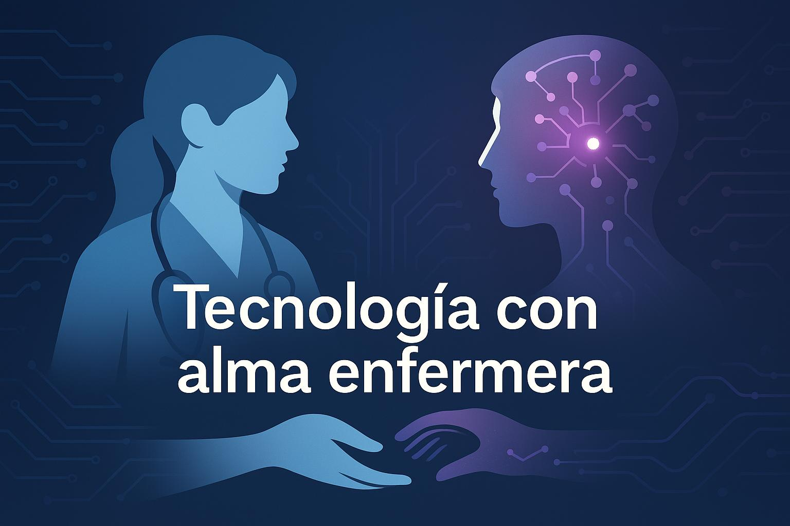
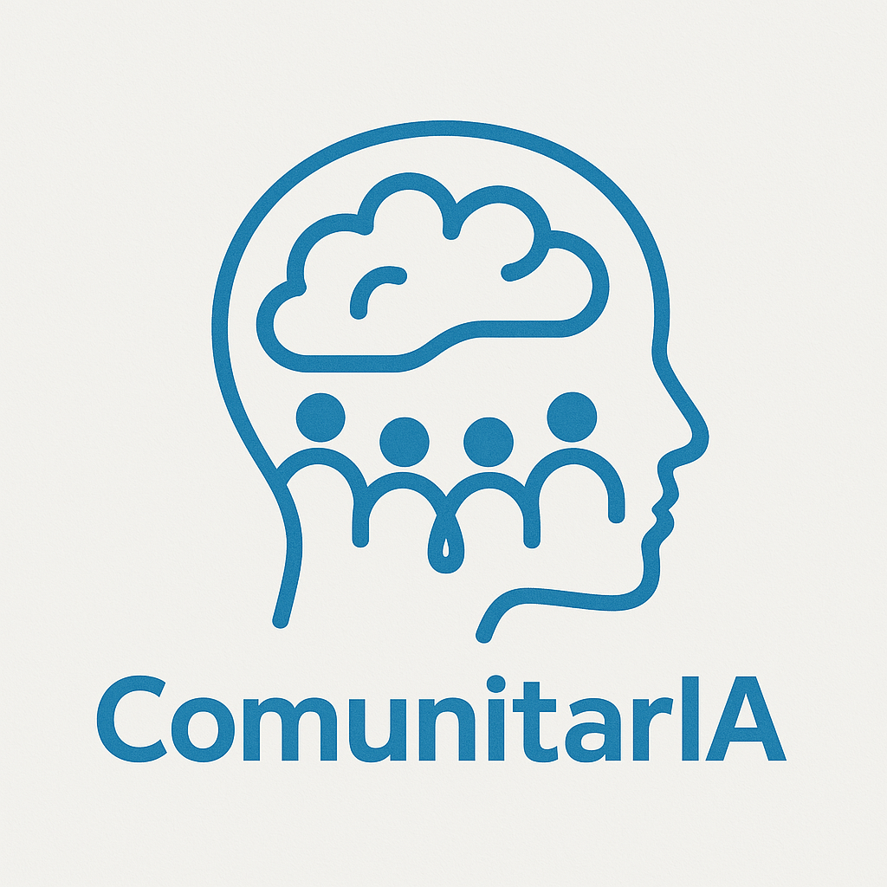

# 👨‍⚕️ Hola, soy Adrián 👋  
Enfermero especialista en familiar y comunitaria, apasionado por la IA, la salud digital y la formación sanitaria.

<!-- Banner principal -->

  

---

## Sobre mí

Apasionado por los datos, su análisis, la visualización y la estadística aplicada a la salud.  
Como enfermero comunitario, trabajo para incorporar la inteligencia artificial, la investigación y el pensamiento basado en datos en la consulta diaria, mejorando la toma de decisiones, la educación para la salud y el seguimiento clínico personalizado.

Actualmente desarrollo:

- 🧪 Un estudio sobre la **percepción de la IA en enfermería de atención primaria gallega**.  
- 📲 Una **app para pacientes anticoagulados**, centrada en la accesibilidad y el seguimiento.  
- 💻 Herramientas IA orientadas a consulta y salud comunitaria: [ESSENCIA](https://chatgpt.com/g/g-67e127dfff808191b7c1212f78042e5f-essencia) y [ComunitarIA](https://chatgpt.com/g/g-67f662e073048191a4c65ddc54c29894-comunitaria).

---

## 🧠 Conoce ComunitarIA

  

**ComunitarIA** es una inteligencia artificial diseñada para ayudar a profesionales y equipos interdisciplinares a desarrollar **acciones de salud comunitaria** paso a paso.

👥 Se basa en:

- La **Guía de Acción Comunitaria para Ganar Salud** (MSSSI)
- Documentos sobre participación, redes comunitarias y metodologías activas
- Principios de equidad, empoderamiento y trabajo intersectorial

🎯 ¿Qué puede hacer por ti?

- Nos lleva de la mano por cada una de las etapas de una acción comunitaria
- Sugerir actividades comunitarias según contexto, recursos y objetivos
- Guiar la planificación, implementación y evaluación
- Proponer ideas innovadoras adaptadas a entornos reales
- Facilitar plantillas, checklists y recursos formativos

💬 Ideal para centros de salud, ayuntamientos, asociaciones y docentes en promoción de la salud.

---

## 🩺 Prueba también ESSENCIA

  

**ESSENCIA** está diseñada para ofrecer apoyo en consulta enfermera con recomendaciones clínicas personalizadas basadas en guías oficiales:

- Protocolos del **SERGAS**
- **PAPPS**, **GuíaSalud**, **NICE**, **OMS**

🔍 ¿Qué incluye?

- Cuidados enfermeros adaptados al perfil del paciente
- Intervenciones en ejercicio físico y alimentación
- Cribados según edad y factores de riesgo
- Educación para la salud y autocuidados
- Derivaciones y propuestas de seguimiento
- Fechas clave para pruebas, vacunas y reevaluaciones

📄 Genera un resumen estructurado para historia clínica o entrega al paciente.  
⚠️ Uso docente y orientativo. Cumplir con el **RGPD** y el **Reglamento Europeo de IA (UE 2024/1689)** es deber de cada profesional.

---

## 📚 Formación y docencia

- Docente en talleres de **IA en salud**, seguridad del paciente y tecnología ética.
- Formador en **búsqueda bibliográfica, revisión sistemática y uso de herramientas IA** para sanitarios.
- Colaborador habitual en:
  - **AGEFEC**: Asociación Galega de Enfermaría Familiar e Comunitaria.
  - **FAECAP**: Federación de Asociaciones de Enfermería Comunitaria y Atención Primaria.

🎓 Máster en Metodología de la Investigación en Ciencias de la Salud (UNIR)

---

## 🧭 Gestión y liderazgo

Como **vocal de los grupos de traballo de AGEFEC**, coordino iniciativas de investigación, producción científica y formación colaborativa en enfermería comunitaria.

---

## 💡 Esta cuenta

Utilizo GitHub como espacio para:

- Aprender programación, especialmente en **Python aplicado a salud**.
- Compartir desarrollos propios y herramientas prácticas con enfoque ético.
- Conectar con otros profesionales interesados en **salud digital, IA y código abierto**.

> *Juntos podemos construir una tecnología ética, aprender en comunidad y transformar los cuidados desde la evidencia.*

