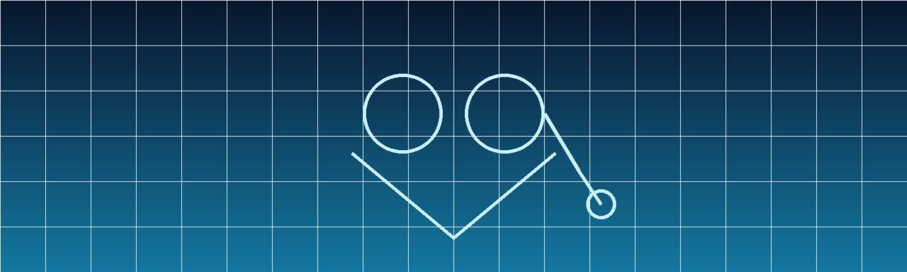

# 👨‍⚕️ ¡Hola! Soy Adrián

  

---

## 🌱 Enfermería comunitaria + Inteligencia Artificial + Salud digital

Soy **enfermero especialista en Familiar y Comunitaria**.  
Me apasiona aplicar la **IA** y la **salud digital** para mejorar la práctica clínica, la educación sanitaria y el trabajo en equipo.  
Uso GitHub como espacio para **aprender, documentar y compartir proyectos propios**, siempre con un enfoque **ético y práctico**.

---

## 🔬 Proyectos destacados en GitHub

- 📊 [**Estadística para Sanitarios**](https://github.com/adrian-ai-salud/EstadisticaParaSanitarios)  
  Material y recursos para formación en bioestadística aplicada a profesionales de la salud.

- 🧩 [**Escalas de Salud Comunitaria**](https://github.com/adrian-ai-salud/escalas-salud-comunitaria-app)  
  Aplicación con escalas validadas y calculadoras para la práctica en salud comunitaria.

- 🩺 [**Enfermería + RAG App**](https://github.com/adrian-ai-salud/enfermeria-rag-app)  
  Proyecto en construcción para aplicar técnicas de **RAG (Retrieval-Augmented Generation)** en consulta de enfermería.

- 🎮 [**Juego Historia de la Enfermería**](https://github.com/adrian-ai-salud/Juego-Historia-de-la-Enfermeria)  
  Proyecto lúdico-educativo sobre hitos y pioneras de la enfermería.

---

## 📚 Investigación y docencia

- Estudio en marcha sobre la **percepción de la IA en enfermería de atención primaria gallega**.  
- Talleres de formación en **IA en salud, ética tecnológica y seguridad del paciente**.  
- Experiencia como formador en **búsqueda bibliográfica, revisión sistemática y herramientas IA** para profesionales sanitarios.

🎓 Máster en **Metodología de la Investigación en Ciencias de la Salud (UNIR)**

---

## 🧭 Liderazgo y colaboración

- Vocal en **AGEFEC** (Asociación Galega de Enfermaría Familiar e Comunitaria).  
- Colaborador en **FAECAP** (Federación de Asociaciones de Enfermería Familiar y Comunitaria).  
- Coordinación de proyectos de **acción comunitaria, investigación y producción científica**.

---

## 🌐 Conecta conmigo

  
  

---

## 🗓️ Última actualización
Septiembre 2025

> *Construyendo una tecnología ética, aprendiendo en comunidad y transformando los cuidados desde la evidencia.*

